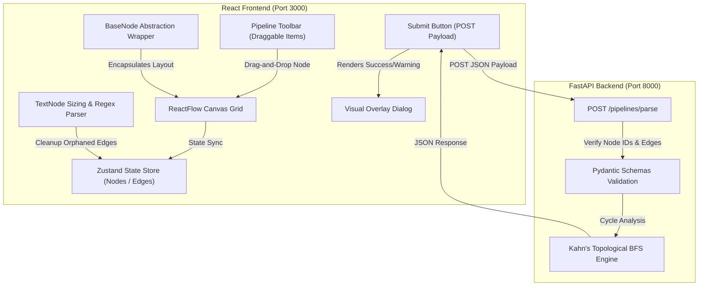

# VectorShift Pipeline & Workflow Editor

A production-grade, interactive, node-based pipeline/workflow builder built with **React**, **ReactFlow**, and **FastAPI**. The project implements a clean abstraction layer for customizable nodes, dynamic variable parsing, auto-resizing text boxes, a dark-themed visual design system, and backend-validated Directed Acyclic Graph (DAG) cycle checks.

---

## 📖 Table of Contents
1. [Project Overview](#-project-overview)
2. [Key Features](#-key-features)
3. [Phase 7 Advanced Features](#-phase-7-advanced-features)
4. [Tech Stack](#-tech-stack)
5. [System Architecture](#-system-architecture)
6. [Folder Structure](#-folder-structure)
7. [Getting Started & Local Setup](#-getting-started--local-setup)
8. [Technical Implementation Deep-Dive](#-technical-implementation-deep-dive)
    - [BaseNode Abstraction](#1-basenode-abstraction)
    - [Dynamic Text Node Logic](#2-dynamic-text-node-logic)
    - [Zustand State Management](#3-zustand-state-management)
    - [Backend DAG Validation](#4-backend-dag-validation)
9. [Developer Guide](#-developer-guide)
    - [Adding a New Node Type](#adding-a-new-node-type)
    - [Coding Standards & Conventions](#coding-standards--conventions)
    - [Debugging Guidelines](#debugging-guidelines)
10. [Production Build & Deployment](#-production-build--deployment)
11. [Troubleshooting & FAQ](#-troubleshooting--faq)
12. [Assumptions & Limitations](#-assumptions--limitations)
13. [Contribution Guidelines](#-contribution-guidelines)

---

## 🌟 Project Overview
This application enables developers and workflow architects to design visual pipelines by dragging modular node cards onto an infinite grid canvas, connecting inputs/outputs, and configuring functional parameters. Upon clicking submit, the entire topology is serialized and evaluated by a Python FastAPI backend to determine graph composition and check for loops/cycles using topological sorting.

---

## 🚀 Key Features

*   **Reusable BaseNode Abstraction:** A wrapper that standardizes header titles, icons, delete mechanisms, body padding, and dynamic vertically centered handle distribution with styled labels.
*   **9 Built-in Node Types:**
    *   `Input` (📥): Local variable source with text/file options.
    *   `Output` (📤): Local terminal sink with text/image options.
    *   `LLM` (🤖): Prompts an AI model using System and Prompt inputs.
    *   `Text` (📄): Multiline textarea with auto-resize and dynamic target handle generation.
    *   `Filter` (🔍): Splits inputs using operators (Equals, Greater Than, Less Than, Contains).
    *   `Merge` (🔗): Joins data streams using Concatenate, Zip, or SQL-style Join strategies.
    *   `Timer` (⏳): Delays trigger execution based on numerical delay seconds and mode.
    *   `API Call` (🌐): Executes HTTP requests using select methods (GET, POST, etc.) and endpoint parameters.
    *   `Conditional` (🔀): Branches execution streams based on conditional expressions.
*   **Dynamic Variable Extraction:** Parses `{{ variableName }}` placeholders in the Text node in real-time to generate left-aligned input handles.
*   **Automatic Orphan Edge Cleanup:** Automatically detaches and deletes edges connected to a variable handle when the variable token is erased.
*   **Premium Dark Design System:** Styled with responsive glassmorphic cards, glowing connections, color-coded node headers, and floating widgets.
*   **FastAPI DAG Validation:** Uses Kahn's topological sort BFS algorithm to check for loops and return node/edge tallies.

---

## 🌟 Phase 7 Advanced Features

To transition this application from a technical assessment prototype into a production-grade workflow design tool, five premium frontend engineering enhancements have been implemented:

### 1. Undo/Redo Temporal State History Stack
- **Purpose:** Allows users to confidently experiment with graph structures, node positions, and field settings, knowing they can revert or replay any change.
- **Implementation:**
  - Maintains `past` and `future` stacks of states inside the Zustand store in [store.js](file:///e:/frontend_technical_assessment/frontend/src/store.js).
  - Automatically captures snapshots on key events: adding nodes, connection connections, deletions, and stopping node drag (`onNodeDragStop`).
  - Inputs typing updates are debounced (800ms window) before snapshotting to prevent cluttering history with keystroke fragments.
  - Exposes `undo()` and `redo()` actions bound to the visual toolbar controls and keyboard triggers.

### 2. Keyboard Shortcuts & Command Palette
- **Purpose:** Maximizes workflow productivity for power users and provides keyboard-only canvas navigability.
- **Implementation:**
  - Centralized global event listener utility hook [useKeyboardShortcuts.js](file:///e:/frontend_technical_assessment/frontend/src/utils/useKeyboardShortcuts.js) handles shortcut actions when focus is outside form fields.
  - Bindings: `Ctrl+Z` (Undo), `Ctrl+Shift+Z` / `Ctrl+Y` (Redo), `Ctrl+K` (Command Palette), `Ctrl+S` (Submit & Validate), `Ctrl+A` (Select all nodes), `Esc` (Close overlays).
  - Searchable overlay component [CommandPalette.js](file:///e:/frontend_technical_assessment/frontend/src/CommandPalette.js) styled with glassmorphism, fully navigable using keyboard arrow keys and Enter.
  - Support list of 15+ commands covering node creation, history tracking, data operations, and canvas clearing.

### 3. Toast Notification System
- **Purpose:** Replaces intrusive web alert dialogs with sliding, non-blocking alert cards stacked in the bottom-right viewport.
- **Implementation:**
  - Implements a global React Context Provider [ToastContext.js](file:///e:/frontend_technical_assessment/frontend/src/utils/ToastContext.js) exposing single-instance toasts (`toast.success()`, `toast.error()`, `toast.warning()`, `toast.info()`).
  - CSS animations handle entry slide-ins, and individual timers auto-dismiss toasts after 5 seconds (ensuring only a single toast is visible at any given time).
  - Fully accessible using `role="alert"` and `aria-live="polite"` tags.

### 4. JSON Serialization Export/Import
- **Purpose:** Restores persistence to the editor by enabling users to download and restore their pipeline graphs.
- **Implementation:**
  - **Export:** Serializes nodes and edges arrays into a schema-validated JSON blob, initiating browser download as `pipeline-export.json`.
  - **Import:** Exposes a file dialog to parse JSON configurations. Validates keys schema before replacing canvas state, scans IDs of imported nodes, and calibrates the `nodeIDs` type counters to avoid collisions on future additions. Supports full history Undo after importing.

### 5. Typed Connection Validation Rules
- **Purpose:** Prevents invalid edges, cycles, and logic errors proactively before connections are finalized.
- **Implementation:**
  - Handles declare semantic datatypes appended as suffixes to their HTML element IDs (e.g., `llm-system-text` for text, `input-value-any` for general compatibility).
  - The ReactFlow canvas invokes `isValidConnection` on hover:
    - Rejects self-loops (node connecting to itself).
    - Rejects duplicate edges (connecting same inputs/outputs twice).
    - Restricts targets to a single incoming edge to avoid conflicting inputs.
    - Validates datatypes: Allows connection only if source datatype matches target datatype OR if either is `"any"`.
  - **Visual Feedback:** Uses CSS variables and classes (`.react-flow__handle-connecting`, `.react-flow__handle-valid`). When drag starts, all handles dim to 30% opacity, and only compatible target handles light up green with a pulse outline.

### 6. Connection Line Style Customizer
- **Purpose:** Enhances pipeline clarity by allowing users to select custom styling and routing for connection wires.
- **Implementation:**
  - Exposes `connectionStyle` (`solid` | `dashed` | `dotted`) and `connectionRouting` (`smoothstep` | `straight` | `step` | `default`/bezier) configurations in the Zustand store.
  - Dropdown controls in the toolbar allow users to configure these properties.
  - **Dynamic Style Fix:** Disabled React Flow's default `animated` property in the store to prevent its hardcoded dash array from overriding styles. Instead, custom SVG class-binding dynamically applies `strokeDasharray`, `strokeLinecap`, and `strokeWidth` parameters in `CustomEdge.js` to trigger instant changes.
  - **Visual Motion:** A CSS-defined `edge-animated` class animates the custom dash-offsets smoothly for dashed and dotted lines, leaving solid lines perfectly static.

### 7. Interactive Edge Deletion & Selection UX
- **Purpose:** Enables users to select a connection line easily and delete it using standard keyboard keys or a visual button.
- **Implementation:**
  - **Click Target Expansion:** Renders a 20px-wide invisible path overlay (`stroke="transparent"`, `strokeWidth={20}`, `pointerEvents="stroke"`) on top of the visible path in `CustomEdge.js` to serve as a generous click and hover capture target.
  - **Glow & Hover Feedback:** CSS transitions apply a sleek drop-shadow glow and thicken the stroke width (`3.5px` and indigo color) on hover (`:hover`) and selection (`.selected`) states.
  - **Visual Delete Widget:** When an edge is selected, a floating red circular button rendering a Lucide-based close icon is drawn at the midpoint of the path.
  - **Global Bindings:** The [useKeyboardShortcuts.js](file:///e:/frontend_technical_assessment/frontend/src/utils/useKeyboardShortcuts.js) hook captures `Delete` and `Backspace` keys when canvas elements are selected, removing them immediately.

### 8. Lucide Icons Migration
- **Purpose:** Standardizes visual assets across the toolbar, nodes, and canvas controls with modern, high-quality, lightweight SVG icons.
- **Implementation:**
  - Created a dedicated icon module [Icons.js](file:///e:/frontend_technical_assessment/frontend/src/utils/Icons.js) containing custom Lucide-compliant React components (`UndoIcon`, `RedoIcon`, `ExportIcon`, `ImportIcon`, `TrashIcon`, `KeyboardIcon`, `ZapIcon`, `PlayIcon`, `XIcon`).
  - Replaced all previous emojis and character icons in the Toolbar, custom nodes, delete overlays, and validation buttons with these professional SVG components.

---

## 🛠️ Tech Stack

### Frontend
*   **React 18.2.0**: UI Component Library.
*   **ReactFlow 11.8.3**: Node-based editor grid.
*   **Zustand 4.5.2**: State container.
*   **Vanilla CSS**: Glassmorphic custom design tokens.

### Backend
*   **FastAPI 0.111.0**: Python ASGI framework.
*   **Pydantic v2**: Requests validation schemas.
*   **Uvicorn 0.30.0**: High-performance ASGI server.

---

## 🏗️ System Architecture



### Component Hierarchy
*   **App**
    *   **PipelineToolbar** -> DraggableNode (x9)
    *   **PipelineUI** -> ReactFlow Grid -> BaseNode -> Node Components
    *   **SubmitButton** -> Custom Modal Dialog

---

## 📁 Folder Structure

```
frontend/
├── public/                  # Static assets
└── src/
    ├── components/          # Reusable components
    ├── nodes/               # Node-specific implementations
    │   ├── BaseNode.js      # Core abstraction container
    │   ├── inputNode.js     # Input source node
    │   ├── outputNode.js    # Output terminal node
    │   ├── llmNode.js       # AI Large Language Model card
    │   ├── textNode.js      # Variable extractor & textarea card
    │   ├── filterNode.js    # Condition filter node
    │   ├── mergeNode.js     # Data merge card
    │   ├── timerNode.js     # Scheduler timer card
    │   ├── apiCallNode.js   # HTTP connection card
    │   ├── conditionalNode.js # Logic flow branch card
    │   └── index.js         # Barrel node exporter
    ├── utils/
    │   └── parseVariables.js # Regex utility extracting {{ variables }}
    ├── App.js               # Parent interface structure
    ├── index.css            # Dark theme stylesheet & variables
    ├── index.js             # Frontend entry point
    ├── store.js             # Zustand actions & state definitions
    └── ui.js                # Canvas drop & edge drawing controller
backend/
├── main.py                  # API routes, CORS setup, and Kahn's algorithm
└── requirements.txt         # Backend Python packages
```

---

## 🌐 Deployed Environments

The project is fully integrated and deployed in production environments:
*   **Production Frontend:** [https://vectorshiftyc.netlify.app/](https://vectorshiftyc.netlify.app/)
*   **Production Backend API:** [https://vectorshift-7itg.onrender.com/](https://vectorshift-7itg.onrender.com/)

### Configuration Details
*   **Frontend Endpoint Resolution:** The frontend dynamically targets the deployed Render backend by default. For local custom environments, you can configure the backend URL using the environment variable `REACT_APP_BACKEND_URL`.
*   **Backend CORS Policy:** The FastAPI backend is configured to restrict origins and explicitly whitelist `https://vectorshiftyc.netlify.app` along with local development endpoints (`http://localhost:3000`, `http://localhost:3001`), resolving browser credential and origin headers compatibility issues.

---

## 💻 Getting Started & Local Setup

### Prerequisites
*   **Node.js**: v18 or later.
*   **npm**: v9 or later.
*   **Python**: v3.9 or later.
*   **pip**: Python packet manager.

### Step-by-Step Installation

#### 1. Setup the Python Backend
1.  Navigate into the `backend/` directory:
    ```bash
    cd backend
    ```
2.  Install Python dependencies:
    ```bash
    pip install fastapi uvicorn pydantic
    ```
3.  Launch the FastAPI server using Uvicorn:
    ```bash
    uvicorn main:app --reload --port 8000
    ```
    *   The backend will be running on [http://localhost:8000](http://localhost:8000). You can inspect the interactive OpenAPI documentation at [http://localhost:8000/docs](http://localhost:8000/docs).

#### 2. Setup the React Frontend
1.  Open a new terminal window and navigate into the `frontend/` directory:
    ```bash
    cd frontend
    ```
2.  Install npm dependencies:
    ```bash
    npm install
    ```
3.  Launch the development server:
    ```bash
    npm start
    ```
    *   The React development environment will load on [http://localhost:3000](http://localhost:3000).

---

## 🔍 Technical Implementation Deep-Dive

### 1. BaseNode Abstraction
All 9 custom node types wrap their content in `<BaseNode>`. It maps arrays of handle metadata into ReactFlow `<Handle>` elements:
*   **Dynamic Spacing:** Spacing uses the algorithm:
    $$\text{topPercent} = \frac{\text{index} + 1}{\text{totalHandles} + 1} \times 100\%$$
    This vertical centering automatically adapts as height updates.
*   **Label Offsets:** Text elements display handle labels directly on the left or right edges inside the card layout.

### 2. Dynamic Text Node Logic
*   **Auto-Resize:** Adjusts node dimensions using a canvas text-width calculation:
    ```javascript
    const context = canvas.getContext('2d');
    context.font = '12px Inter, sans-serif';
    const textWidth = context.measureText(longestLineText).width;
    ```
    Height dynamically updates based on the textarea's `scrollHeight`.
*   **Dangling Edges Hook:** Automatically tracks changes in `variables` arrays. If an active edge in the Zustand store references an erased variable, it triggers a removal event:
    ```javascript
    useEffect(() => {
      const activeHandles = new Set(inputs.map(i => i.id));
      const orphaned = edges.filter(e => e.target === id && !activeHandles.has(e.targetHandle));
      if (orphaned.length > 0) {
        onEdgesChange(orphaned.map(e => ({ id: e.id, type: 'remove' })));
      }
    }, [currText, edges]);
    ```

### 3. Zustand State Management
*   **Store Structure (`store.js`):** Main state holds arrays of `nodes` and `edges`, and a mapping of `nodeIDs`.
*   **Controlled Node State:** Inputs in nodes update the store dynamically:
    ```javascript
    const updateNodeField = useStore((s) => s.updateNodeField);
    updateNodeField(nodeId, 'inputName', e.target.value);
    ```
*   **Initialization Effect:** Mount-time `useEffect` setups populate the store with defaults to prevent empty fields when submitting.

### 4. Backend DAG Validation
*   **Kahn's BFS Loop Check:**
    1.  Parse nodes and edges from POST parameters.
    2.  Map node in-degree counts (number of incoming edges).
    3.  Load all nodes with in-degree 0 into a Queue.
    4.  BFS: pop nodes, increment counter, decrement neighbors' in-degree. Push to queue if neighbor's in-degree drops to 0.
    5.  A cycle exists if `visitedCount != len(nodes)`.

---

## 🛠️ Developer Guide

### Adding a New Node Type
To add a new node type to the pipeline editor:

1.  **Create the Component:** Write `myNewNode.js` in `src/nodes/`. Wrap it in `<BaseNode>` and use the CSS classes:
    ```javascript
    import { BaseNode } from './BaseNode';
    export const MyNewNode = ({ id, data }) => (
      <BaseNode id={id} title="My Node" icon="⭐" className="node-myNewNode"
                inputs={[{ id: `${id}-in`, label: 'In' }]}
                outputs={[{ id: `${id}-out`, label: 'Out' }]}>
        <div className="node-field-group">
          {/* Custom Form Fields */}
        </div>
      </BaseNode>
    );
    ```
2.  **Export the Component:** Register it in [index.js](file:///e:/frontend_technical_assessment/frontend/src/nodes/index.js).
3.  **Add Drag Option:** Open [toolbar.js](file:///e:/frontend_technical_assessment/frontend/src/toolbar.js) and add the type:
    ```javascript
    <DraggableNode type='myNewNode' label='My Node' />
    ```
4.  **Register Types:** Add the node type in [ui.js](file:///e:/frontend_technical_assessment/frontend/src/ui.js) `nodeTypes` map:
    ```javascript
    const nodeTypes = {
      ...
      myNewNode: MyNewNode,
    };
    ```
5.  **Accent Styling (Optional):** Define top-strip header styling in `index.css`:
    ```css
    .node-myNewNode .base-node-header { border-bottom: 2px solid var(--accent-pink); }
    .draggable-node.myNewNode::before { background-color: var(--accent-pink); }
    ```

### Coding Standards & Conventions
*   **Declarative Form Design:** Forms inside nodes must read values from `data.field` (synced to store) and write changes via `updateNodeField`.
*   **No Inline Style Overrides:** Visual changes must use CSS variables and class selectors in `index.css`.
*   **Handle Naming Guidelines:** Standardize input target formats to `${id}-var-${name}` and source outputs to `${id}-output`.

### Debugging Guidelines
*   **Zustand Dev:** Open Chrome DevTools and examine `window.__ZUSTAND_STATE__` or add console selectors in custom action steps.
*   **ReactFlow Inspector:** Toggle `proOptions={{ hideAttribution: true }}` to inspect handle properties.
*   **FastAPI Debug Docs:** Visit [http://localhost:8000/docs](http://localhost:8000/docs) to verify schema payloads.

---

## 📦 Production Build & Deployment

### 1. Production Frontend Build
To package the React code into highly optimized static assets:
```bash
cd frontend
npm run build
```
This outputs a `build/` directory containing bundled code files suitable for static hosting.

### 2. Deployment
*   **Frontend:** Deploy the `build/` folder to Vercel, Netlify, or AWS S3.
*   **Backend:** Deploy the FastAPI server on Render, Heroku, or AWS EC2:
    ```bash
    uvicorn main:app --host 0.0.0.0 --port $PORT
    ```

---

## ❓ Troubleshooting & FAQ

#### Q: Submit fails with "Failed to connect to the backend server"
*   **A:** Ensure your FastAPI process is running locally on port 8000. Start it via `uvicorn main:app --reload --port 8000`.

#### Q: The node connections do not snap or look misaligned
*   **A:** Make sure you did not wrap `<Handle>` elements in custom container divs. ReactFlow coordinates are calculated relative to the direct node bounds. Keep handles as direct guidelines inside `BaseNode`.

#### Q: React terminal fails to start on port 3000
*   **A:** If port 3000 is occupied, type `y` when prompted to start on a different port, and make sure your FastAPI's CORS origins permit local requests from that port.

---

## 📌 Assumptions & Limitations
*   **Dynamic Variable Extraction Constraints:** Currently extracts matching alphabetic identifiers. Malformed expressions (e.g. nested brackets `{{ x {{ y }} }}`) are skipped.
*   **State Latency:** Debouncing store sync by 200ms avoids re-rendering lags on typing, which means submissions sent immediately after a keystroke might miss the final character.
*   **Static Positioning:** Dropped nodes default to layout positions based on dragging mouse offsets.

---

## 🤝 Contribution Guidelines
1.  Branch names should follow the pattern `feature/name` or `bugfix/issue-id`.
2.  Maintain separation of presentation styles by putting them in `index.css`.
3.  Add unit test files in `utils/__tests__/` when adding mathematical parsing functions.
